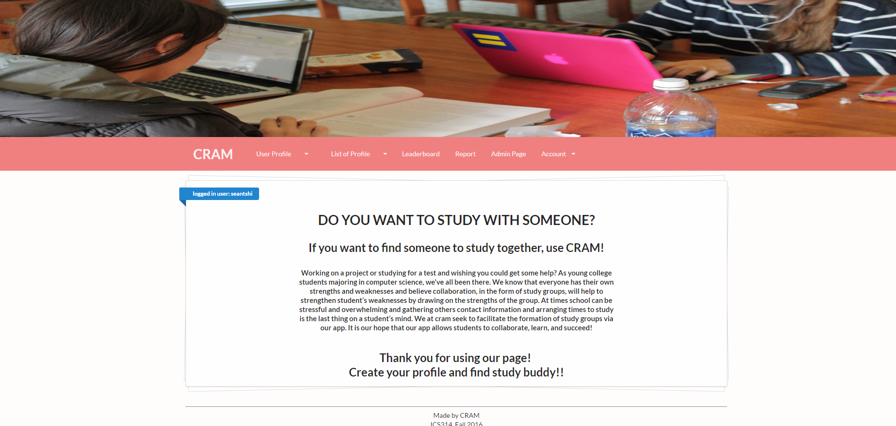
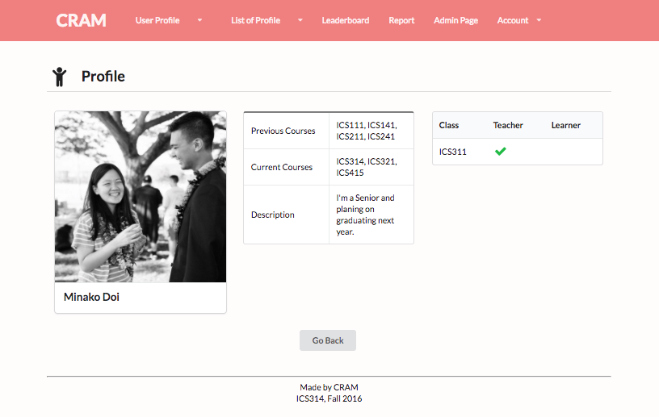

## CRAM

 

 

This web app was a group project for ICS314.  I was assigned to a group of four students to work on this final project.  The purpose of this app was to create an app where students especially in Computer Science Department to collaborate and study together.  In this app, CRAM, users will need to log in with UH account. After they log in, they can create a profile with some basic information about themselves and they are good to create a study session.  They can view other students' profile and all study sessions which are created by them.  There is also a function that allows the users to report to admin if there is any trouble.

I was assigned to create a login page, landing page, terms of use page, profile page, study session page, report page and admin pages as well as designing most of other pages.  At first, I created each mock-up page and then connected to database (we used MongoDB collection in Meteor) to get a data.  Moreover, some pages required getting two different collections such as from profiles and study session.  It was one of the complicated functionality in this app.

I enjoyed creating all those pages using [Semantic UI](http://semantic-ui.com) to design pages.
